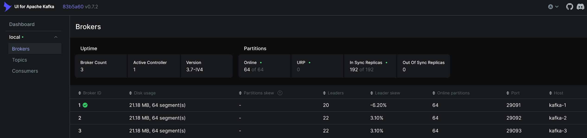

# 🧾 Демонстрационный сервис с Kafka, PostgreSQL и кешем

---

## 📌 Обзор

Простой микросервис на Go с базой данных и очередью сообщений. Сервис получает данные заказов из Kafka, сохраняет их в PostgreSQL и кэширует в памяти для быстрого доступа. Имеет HTTP-интерфейс для получения данных по `order_uid`.

---

## 🚀 Установка и запуск

### 1. Клонирование репозитория

```bash
git clone git@github.com:zayneshzangar/level0.git
cd level0
```

### 2. Установка зависимостей

```bash
go mod tidy
```

### 3. Запуск Kafka и PostgreSQL + создание пользователя и БД

```bash
cd scripts
./script.sh
```

### 4. Удаление инструментов после завершения работы

```bash
cd scripts
./script.sh --delete
```

> ⚠️ **Примечание:**
> Если у вас есть нужные, но неиспользуемые Docker-тома (`volumes`), не используйте параметр `--delete`.
> Также вы можете закомментировать строку с удалением `volume` в скрипте `delete-kafka.sh` и удалить тома вручную.
> Имена томов Kafka генерируются автоматически, что затрудняет их удаление по названию в скрипте.

---

## 📦 Добавление Kafka Topic

### Проверка запуска Kafka:

После запуска убедитесь, что Kafka работает корректно и один из брокеров назначен **контроллером**:

1. Перейдите по адресу: [http://localhost:8090](http://localhost:8090)
2. В разделе `Dashboard` → `Brokers` проверьте:

   * Сколько брокеров активно.
   * Какой из них выбран контроллером (`Controller ID`).



### Добавление `topic`:

```bash
cd scripts
./create-topic.sh
```

---

## 🧱 Архитектура проекта

Проект организован по принципам **чистой архитектуры**: слои разделены по ответственности.

<details>
<summary>Структура проекта</summary>

```
├── assets
│   └── kafka-ui.png
├── cmd
│   ├── consumer
│   │   └── main.go
│   └── producer
│       └── emulator_producer.go
├── config
│   └── config.go
├── frontend
│   ├── index.html
│   ├── script.js
│   └── style.css
├── go.mod
├── go.sum
├── internal
│   ├── controller
│   │   ├── http
│   │   │   └── v1
│   │   │       ├── handler.go
│   │   │       └── router.go
│   │   └── kafka
│   │       └── consumer.go
│   ├── entity
│   │   └── entity.go
│   ├── service
│   │   ├── endpoint.go
│   │   └── service.go
│   └── storage
│       ├── connection.go
│       ├── create_tables.go
│       ├── endpoint.go
│       └── storage.go
├── note.txt
├── README.md
└── scripts
    ├── create-db.sh
    ├── create-topic.sh
    ├── delete-kafka.sh
    ├── delete-psql.sh
    ├── docker-compose-kafka.yaml
    ├── docker-compose-psql.yaml
    ├── env.sh
    ├── run-kafka.sh
    ├── run-psql.sh
    └── script.sh
```

</details>

---

## 🛠️ Требования

Убедитесь, что установлены следующие инструменты:

* **Go** — версия 1.18 или выше
* **Bash** — или совместимый терминал
* **Docker** — для Kafka и PostgreSQL
* **Python 3** — для запуска frontend-сервера

---

## 📚 Go-зависимости

| Пакет                                                 | Назначение                                 |
| ----------------------------------------------------- | ------------------------------------------ |
| `github.com/google/uuid`                              | Генерация уникальных ID (UUID) для заказов |
| `github.com/confluentinc/confluent-kafka-go/v2/kafka` | Kafka-клиент для Go                        |
| `github.com/caarlos0/env/v10`                         | Парсинг переменных окружения в структуры   |
| `github.com/joho/godotenv`                            | Загрузка переменных из `.env` файлов       |
| `github.com/gorilla/mux`                              | HTTP-роутер                                |
| `github.com/lib/pq`                                   | PostgreSQL-драйвер для Go                  |

---

## 📤 Запуск эмулятора сообщений Kafka

```bash
source scripts/env.sh
go run cmd/producer/emulator_producer.go
```

👉 После запуска можно посмотреть сообщения в Kafka UI → `Dashboard` → `Topics`.

---

## 📥 Запуск основного приложения

```bash
source scripts/env.sh
go run cmd/consumer/main.go
```

Пример запроса через `curl`:

```bash
curl http://localhost:8080/order/<order_uid> | jq
```

---

## 🌐 Запуск frontend-интерфейса

```bash
cd frontend
python3 -m http.server 8081
```

Интерфейс будет доступен по адресу: [http://localhost:8081](http://localhost:8081)

---

## 🔌 API

| Метод | Эндпоинт             | Описание                |
| ----- | -------------------- | ----------------------- |
| GET   | `/order/<order_uid>` | Получение данных заказа |

---
